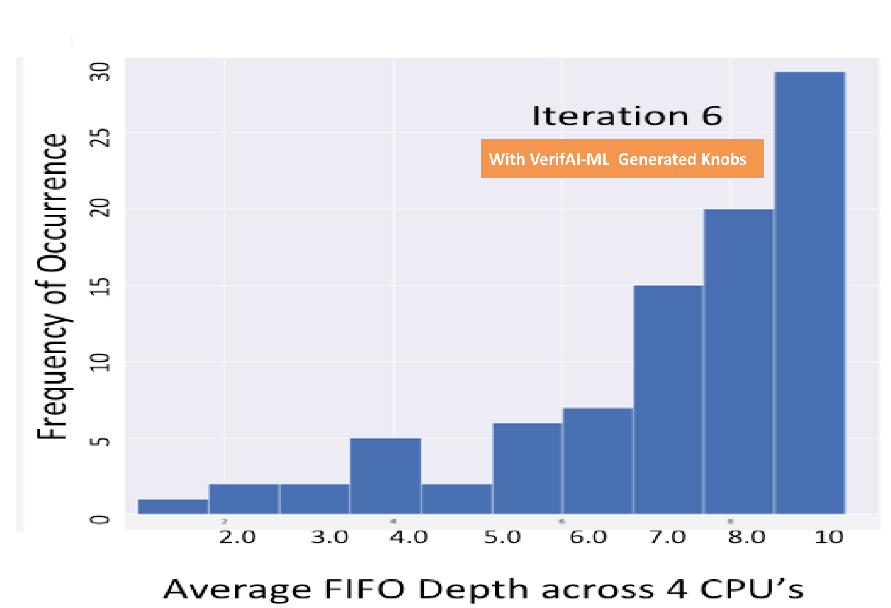
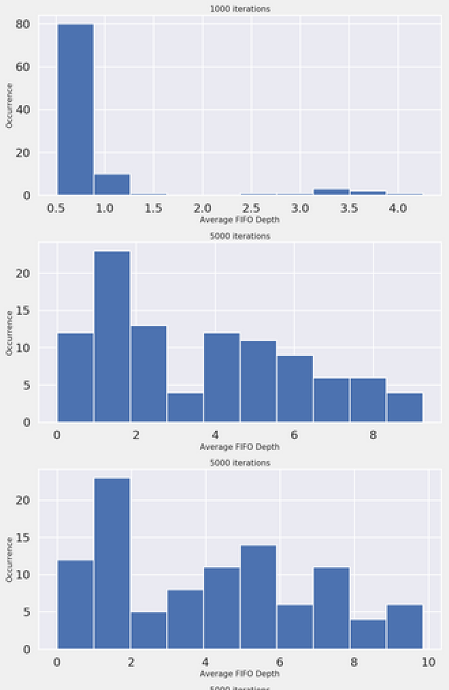

 
    

=============================================================================                                                        

Copyright 2020 Verifai Inc All Rights Reserved.                                                                                         

==============================================================================

# VerifAI Optimizer
Verifying hardware and software with deep learning
Here is a link to the entire article published on Arxiv describing this experiment. [Doing better than random](https://arxiv.org/abs/1909.13168)

## About VerifAI Optimizer

Let's say we have a dataset with a set of input features which can be controllable knobs for a particular target column. These knobs can be set on some simulator and the simulator returns the value of the target variable for those settings.
The role of the optimizer is to find the best *knob settings* to maximize the value of the *target columns*.

Example dataset CSV file


         

The optimizer uses both supervised and reinforcement learning to map the knobs to the reward using a neural network as a function approximator and then uses global optimization algorithms to find the optimum input knobs.

Some other examples of this are in optimal control of electric power. In this repo we will demonstrate how to optimize and fill up the FIFO queues on a [MESI Cache Controller](#Example-2-The-FIFO-Cache-Controller-experiment) from [opencores.org](http://www.opencores.org).

Maximizing the FIFO queue depth is a non-trivial task for random tests, and requires a DV expert to write directed-tests to achieve high FIFO queue depths.
This example shows that the VerifAI Optimizer, can maximize the FIFO depth significantly better than a random test, and also better than  directed tests.

You can also run your [own csv datasets](#Example-3-Run-your-own-CSV-file-thru-the-optimizer) thru the optimizer to find the best *knob settings* to maximize  *target column(s)*

## Installation

Download and install the VerifAI optimizer on your Linux or MacOS machine.

1. [*Use your existing python3 setup to run*](#Use-your-existing-python3-setup) -- Download a tarball [*VERIFAI.AI-1.0.tar.gz*](https://github.com/verifai-ai/optimizer/blob/master/VERIFAI.AI-1.0.tar.gz)  

##  Use your existing python3 setup 

Untar it and install requirements
```bash
tar -xvf  *VERIFAI.AI-1.x.tar.gz*
cd VERIFAI.AI-1.x
pip3 install -r requirements.txt
```
```bash
python3 signup.py
```

## Example 1 Run the sample optimizer example (test the flow)

```bash
python3 optimize.py -c config.json -tr FIFO_knobs.csv
```

### Run FIFO run_sims with Verilator

```bash
cd FIFO
python3 run_sims.py -c config.json -ir random_knobs.csv  -iter 3
```
### Run FIFO run_sims with Cadence

```bash
cd FIFO
python3 run_sims_cdn.py -c config.json -ir random_knobs.csv  -iter 3

This will produce a CSV file and a combined_histogram.png plot.
```


Figure-1: The histogram distribution of the column to optimize has been shifted to the right using the optimizer

## Example 2 The FIFO Cache Controller experiment


### About the Cache controller experiment

Cache Controller Design - Experiment 1

The Cache Controller design is an opensource design from [opencores.org](http://www.opencores.org) and its licensed under [LGPL](http://www.opencores.org/lgpl.shtml).

The experiment is a Cache Controller design shown in Fig 1. The controller supports up to four CPU ports. Input transaction collisions are checked at the input stage where four FIFOs - one per CPU port - holds transactions which fail collision checks with transactions from another CPU ports and hence must be serviced later.


Figure-2:  Cache Controller with 4 CPU Ports

Input FIFO’s can be so difficult to fill in the presence of random traffic that it seldom or perhaps never reaches a full state even across a very large number of simulations. This has implications for DV coverage since the FIFO must be filled in order to ensure correct operation and to uncover bugs resulting from a FIFO full condition.
After a suitable number of simulation runs were completed, the resulting DV control settings and the corresponding FIFO occupancy simulation results were fed to an VerifAI-RL agent which, once trained, generated a set of recommended settings to use in a subsequent set of runs. After completing this second set of simulation runs using the settings from the RL agent, the results were again fed into the RL agent which generated a subsequent improved set of recommended settings. This process is summarized in Figure-3  below:


Figure-3:  Cache Controller Design VerifAI-RL Flow


Figure below shows the resulting FIFO occupancy for each subsequent iteration (red curve).


Figure-4:  FIFO Occupancy with VerifAI-RL generated knobs versus Random

Note that the RL agent quickly learns how to adjust the DV environment control settings in order to maximize the FIFO occupancy. A set of runs using purely random settings without the benefit of RL-based machine learning is also shown for comparison (blue curve).
The results shown in Figures below demonstrate how an RL-based approach can quickly and automatically optimize design coverage parameters resulting in better design coverage and accelerated stress testing of a design.


   

Figure-5:  Average  FIFO Depth with Random Stimulus and Iteration-6 using Verifai’s ML/RL

The resulting plots are placed in the folder 'images/mesi_cache_fifo' 
The resulting output of the optimizer are VERIFAI_RL_FIFO_input_*.csv , these are the inputs knobs settings for the simulator.

There is also a combined plot generated that is called 'combined_actual.png' , this plot shows the 'ground truth' results from the simulator after each iteration.



Figure-6:  Average FIFO Depth after each batched-iteration of the simulation (ground truth)


## Example 3 Run your own CSV file thru the optimizer

Upload your dataset in CSV format and identify the columns that are 'knobs' and the ones that are the 'target columns'.
Edit the file config.json and reflect the knobs and columns you want to optimize.

Example dataset CSV file


```
"Config": {
  "RewardPredictor":{
    "reward_column": ["CostPerMonth"], <<-- Change this
    "experiment_type":"TempratureControl",  <<-- Your experiment name
    "reward_stat": Null,  <<-- If you have multiple reward_columns, you can specify 'max | min | average'
                               <<-- If single column name, this value should be None
      }                                       
  }

python3 bin/optimize.py -c config.json -tr <your-dataset.csv>
```


